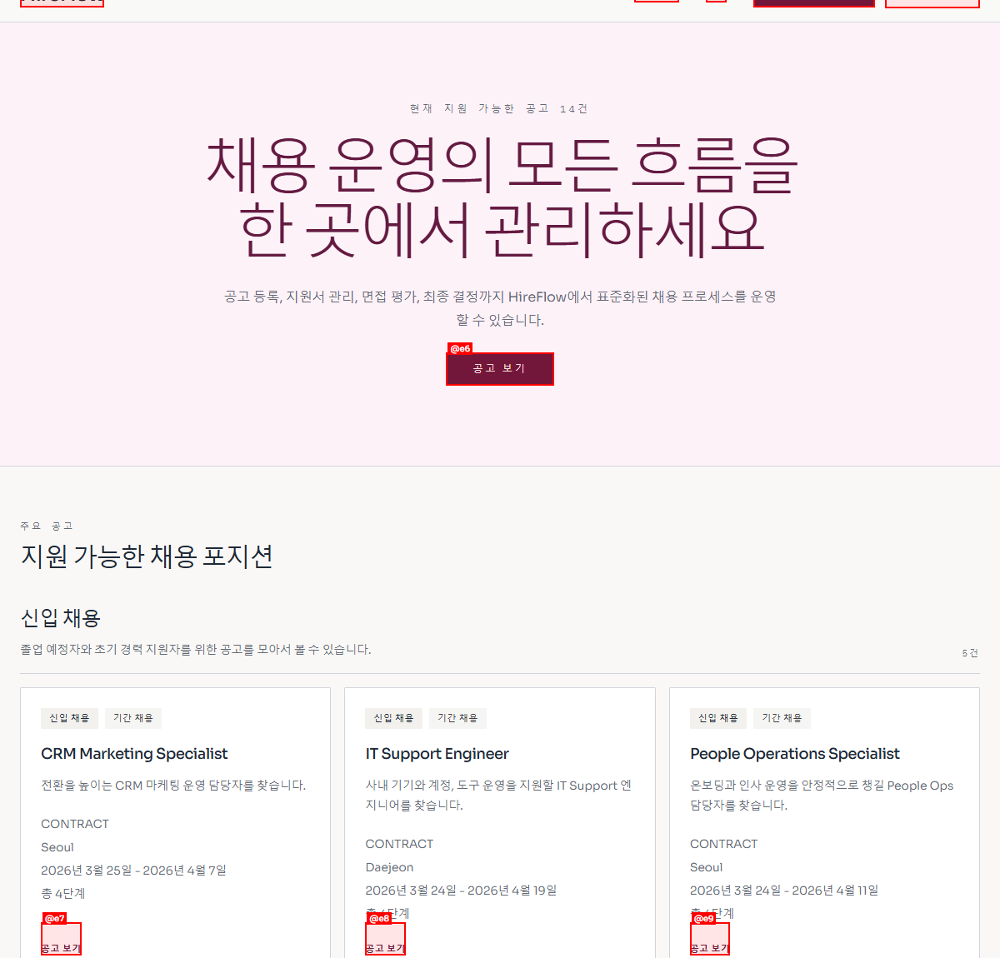
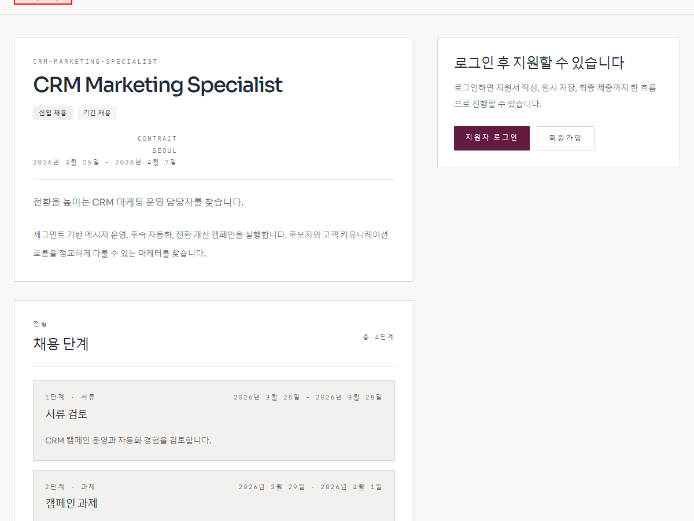
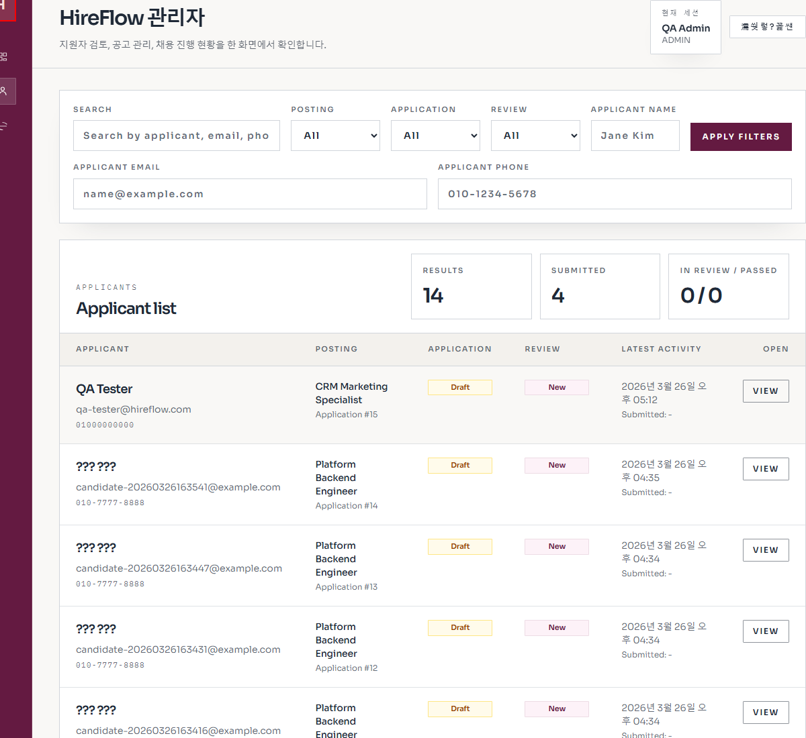
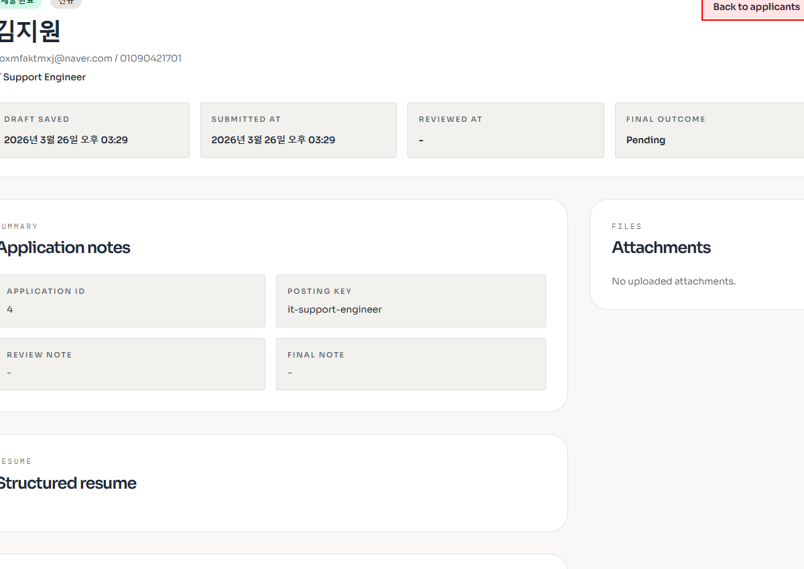

# vibe-rec

vibe-rec는 공고 등록부터 지원서 접수, 검토, 면접, 최종 결정까지 한 흐름으로 관리하는 채용 운영 플랫폼입니다.  
현재 저장소 기준으로 `Next.js + Spring Boot + PostgreSQL` 구성이며, 관리자 화면과 지원자 화면이 분리되어 있습니다.

## 주요 화면

### 1. 홈 화면



공개 채용 포지션을 한 번에 훑어보고, 채용 카테고리와 현재 열려 있는 공고 흐름을 바로 확인할 수 있습니다.

### 2. 공고 상세



공고 설명, 채용 단계, 지원 진입 동선을 한 화면에서 보여줘서 지원자 경험을 빠르게 확인하기 좋습니다.

### 3. 관리자 지원자 목록



이름, 이메일, 전화번호, 공고, 지원 상태 기준으로 필터링하면서 지원자 목록과 최신 활동을 함께 볼 수 있습니다.

### 4. 관리자 지원자 상세



지원 기본 정보, 첨부, 구조화 이력서, 검토 메모를 한 화면에 모아두어 실제 운영 검토 흐름을 재현할 수 있습니다.

## 핵심 흐름

- 지원자: 공고 탐색, 지원서 임시 저장, 최종 제출, 내 지원 현황 확인
- 관리자: 공고 관리, 질문 관리, 지원자 검색/필터, 검토 상태 변경
- 채용 운영: 면접 생성, 평가 기록, 최종 결정, 알림 이력 관리

## 기술 스택

- Web: Next.js 16, React 19, TypeScript, Tailwind CSS 4
- API: Spring Boot, Spring Data JPA, Flyway
- Database: PostgreSQL 16

## 로컬 실행

### 1. PostgreSQL

```powershell
docker compose -f compose.deploy.yaml up -d postgres
```

기본 접속 정보:

- Host: `127.0.0.1`
- Port: `5435`
- Database: `vibe_rec`
- Username: `vibe_rec`
- Password: `vibe_rec`

### 2. API

```powershell
cd apps/api
.\gradlew.bat bootRun --args=--server.port=8080
```

### 3. Web

```powershell
cd apps/web
$env:API_BASE_URL="http://127.0.0.1:8080/api"
$env:NEXT_PUBLIC_API_BASE_URL="http://127.0.0.1:8080/api"
npm run dev
```

## 데모 데이터

현실적인 합성 채용 데이터는 아래 두 파일로 관리합니다.

- Flyway migration: `apps/api/src/main/resources/db/migration/V25__refresh_realistic_demo_dataset.sql`
- 수동 실행용 seed: `apps/api/src/main/resources/db/seed/demo-seed.sql`

수동 seed 적용 예시:

```powershell
docker exec -i vibe-rec-postgres psql -v ON_ERROR_STOP=1 -U vibe_rec -d vibe_rec < apps/api/src/main/resources/db/seed/demo-seed.sql
```

데모용 핫스팟 공고:

- `1001 / platform-backend-engineer / 백엔드 플랫폼 엔지니어`
- 이 공고에는 지원자 `5,000명`이 들어가 있어 검색, 필터, 페이지네이션, 상세 조회 검증에 바로 사용할 수 있습니다.

데모 계정:

- 관리자 비밀번호: `demo1234!`
- 지원자 비밀번호: `candidate123!`

## 검증

```powershell
cd apps/api
.\gradlew.bat test --console=plain
```
