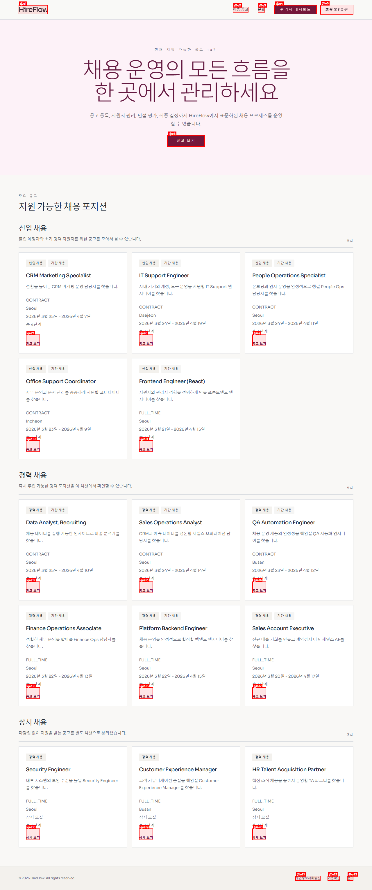
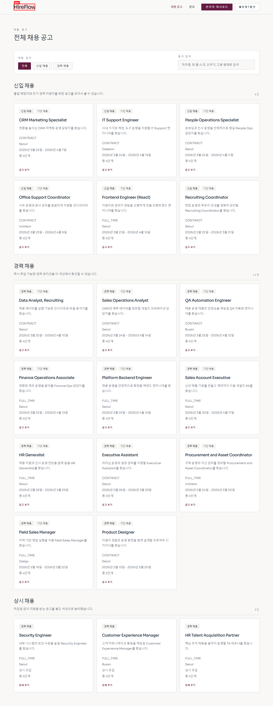
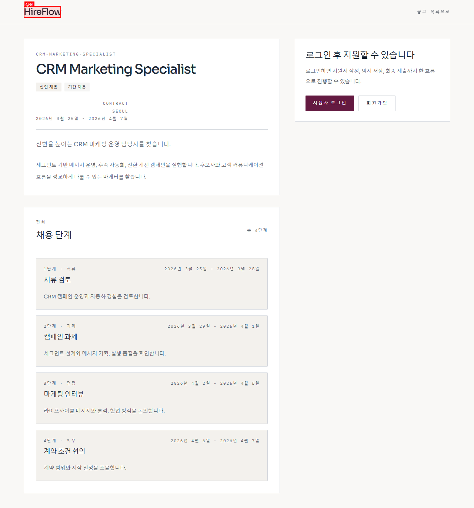
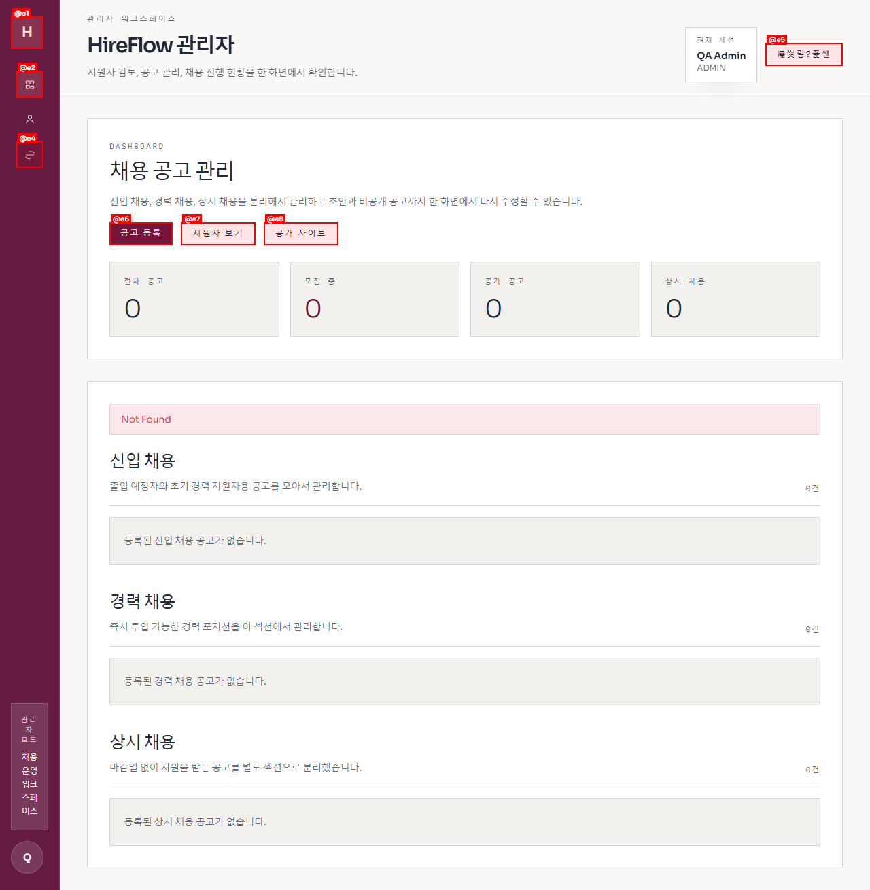
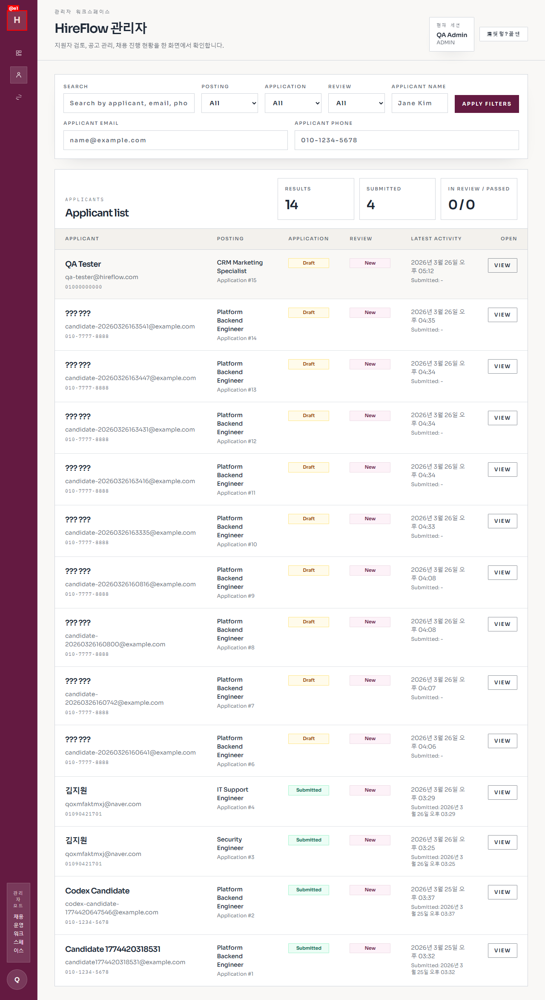

# HireFlow — 채용 운영 플랫폼

> **채용 공고 등록부터 최종 결정까지, 한 곳에서 관리하는 채용 운영 플랫폼**

`HireFlow`는 Next.js 15 App Router + Spring Boot 3 + PostgreSQL 16 기반의 풀스택 채용 관리 시스템입니다.
지원자 셀프 지원부터 관리자 면접·채용 결정까지 전 채용 프로세스를 표준화하여 운영할 수 있습니다.

---

## 주요 화면

### 홈페이지 — 현재 지원 가능한 공고 한눈에



히어로 섹션과 함께 현재 지원 가능한 채용 공고를 카드 그리드로 보여줍니다.
카테고리별(신입·경력·상시)로 구분하고, 공고명·직무·근무지·고용 형태로 실시간 검색이 가능합니다.

---

### 채용 공고 목록 — 검색·필터 지원



전체 공고를 카드형으로 표시하며, 직무명·소개·근무지·고용 형태 키워드로 즉시 필터링됩니다.

---

### 채용 공고 상세 — 로그인 후 지원 시작



공고 상세 정보와 채용 단계 타임라인이 표시됩니다.
로그인하지 않으면 지원하기 버튼이 안내 문구로 대체되며, 로그인 후 4단계 지원 위저드로 진입합니다.

---

### 관리자 대시보드 — 공고별 지원 현황 통계



전체 공고 수·제출된 지원서·검토 중·최종 합격 수를 요약 카드로 보여주며,
공고별 지원자 현황 목록과 빠른 이동 링크를 제공합니다.

---

### 지원자 관리 — 검색·필터·페이지네이션



지원자를 이름·이메일·전화번호·공고·전형 상태·검토 상태로 복합 필터링하고,
페이지 단위로 탐색할 수 있습니다. 각 행에서 바로 상세 화면으로 이동합니다.

---

## 기능 요약

### 지원자(Candidate) 기능

| 기능 | 설명 |
|------|------|
| 회원가입 / 로그인 | 이메일 기반 계정 생성 및 세션 인증 |
| 채용 공고 탐색 | 전체 공고 목록 · 상세 페이지 열람 |
| 4단계 지원 위저드 | 인적사항 → 자기소개/역량 → 학력/경력/스킬 → 질문/첨부/제출 |
| 임시저장(Draft) | 단계 이동 시 자동 저장, 언제든 이어서 작성 |
| 첨부파일 관리 | 이력서·포트폴리오 업로드, 다운로드, 삭제 |
| 공고별 커스텀 질문 | 관리자가 설정한 질문에 답변 작성 |

### 관리자(Admin) 기능

| 기능 | 설명 |
|------|------|
| 관리자 회원가입 / 로그인 | 별도 관리자 계정 및 권한 시스템 |
| 채용 공고 관리 | 공고 생성·수정·스케줄 관리 |
| 커스텀 질문 편집 | 공고별 자유형·선택형·척도형 질문 설정 |
| 지원자 목록 조회 | 복합 필터·페이지네이션 |
| 지원서 검토 | 검토 상태 변경 (새 지원 → 검토 중 → 합격/불합격) |
| 면접 관리 | 면접 일정 등록, 평가 기록, 합산 평점 |
| 최종 채용 결정 | 합격·불합격·보류 처리 |
| 후보자 알림 발송 | 결과 통보 알림 기록 |
| 첨부파일 다운로드 | 지원자 제출 파일 관리자 다운로드 |

---

## 기술 스택

### 프론트엔드 (`apps/web`)

| 항목 | 내용 |
|------|------|
| 프레임워크 | Next.js 15 App Router |
| 언어 | TypeScript 5 |
| 스타일링 | Tailwind CSS 4 |
| 런타임 | React 19 (Server Components + Client Components) |
| 인증 | 쿠키 기반 세션 (지원자·관리자 분리) |

### 백엔드 (`apps/api`)

| 항목 | 내용 |
|------|------|
| 프레임워크 | Spring Boot 3 |
| 언어 | Java 21 |
| ORM | Spring Data JPA + Hibernate |
| DB 마이그레이션 | Flyway (V1 ~ V24) |
| 보안 | 커스텀 세션 인터셉터 + 권한 어노테이션 |

### 데이터베이스

| 항목 | 내용 |
|------|------|
| DBMS | PostgreSQL 16 |
| 스키마 | `recruit`, `platform` 두 스키마로 분리 |
| 시드 데이터 | V22 데모 데이터셋 (공고 20+, 지원자 14명) |

---

## 프로젝트 구조

```
vibe-rec/
├── apps/
│   ├── api/                        # Spring Boot API 서버
│   │   ├── src/main/java/          # 도메인 계층
│   │   │   └── com/viberec/api/
│   │   │       ├── admin/          # 관리자 기능
│   │   │       ├── candidate/      # 지원자 기능
│   │   │       ├── platform/       # 공통 플랫폼
│   │   │       └── recruitment/    # 채용 도메인
│   │   └── src/main/resources/
│   │       └── db/migration/       # Flyway SQL 마이그레이션
│   └── web/                        # Next.js 앱
│       └── src/
│           ├── app/                # App Router 페이지
│           │   ├── admin/          # 관리자 화면
│           │   ├── auth/           # 지원자 인증
│           │   └── job-postings/   # 공고·지원 화면
│           ├── entities/           # 타입 정의
│           ├── features/           # 기능별 컴포넌트
│           └── shared/             # 공통 유틸·API 클라이언트
├── docs/                           # 아키텍처·인증 플로우 문서
└── infra/
    └── docker/                     # 로컬 PostgreSQL Compose 설정
```

---

## 로컬 개발 환경 설정

### 사전 요구사항

- Docker Desktop
- Java 21
- Node.js 20+

### 1. PostgreSQL 시작

```powershell
cd infra/docker
docker compose up -d
```

기본 연결 정보:

| 항목 | 값 |
|------|-----|
| Host | `127.0.0.1` |
| Port | `5435` |
| Database | `vibe_rec` |
| Username | `vibe_rec` |
| Password | `vibe_rec` |

### 2. API 서버 실행

```powershell
cd apps/api
$env:SERVER_PORT="8083"
.\mvnw.cmd spring-boot:run
```

API 기본 주소: `http://127.0.0.1:8083/api`

### 3. 웹 앱 실행

```powershell
cd apps/web
npm install
npm run dev
```

웹 앱 기본 주소: `http://localhost:3000`

`.env.local` 기본값:

```env
API_BASE_URL=http://127.0.0.1:8083/api
NEXT_PUBLIC_API_BASE_URL=http://127.0.0.1:8083/api
```

---

## 주요 URL 경로

### 지원자(공개) 경로

| 경로 | 설명 |
|------|------|
| `/` | 홈 — 지원 가능 공고 목록 |
| `/job-postings` | 전체 채용 공고 목록 |
| `/job-postings/[id]` | 채용 공고 상세 + 지원 진입 |
| `/job-postings/[id]/apply` | 4단계 지원 위저드 |
| `/auth/login` | 지원자 로그인 / 회원가입 |

### 관리자 경로

| 경로 | 설명 |
|------|------|
| `/admin/login` | 관리자 로그인 |
| `/admin` | 관리자 대시보드 |
| `/admin/applicants` | 지원자 목록 |
| `/admin/applicants/[id]` | 지원자 상세 · 검토 · 면접 · 결정 |
| `/admin/job-postings/[id]` | 채용 공고 수정 |
| `/admin/job-postings/[id]/questions` | 커스텀 질문 편집 |

---

## API 엔드포인트

### 공개 API

```
GET  /api/ping
GET  /api/job-postings
GET  /api/job-postings/{id}
GET  /api/job-postings/{id}/questions
```

### 지원자 API (세션 필요)

```
POST /api/candidate/auth/signup
POST /api/candidate/auth/login
GET  /api/candidate/auth/session
POST /api/candidate/auth/logout
POST /api/job-postings/{id}/application-draft
POST /api/job-postings/{id}/application-submit
POST /api/applications/{id}/attachments
GET  /api/applications/{id}/attachments
DELETE /api/attachments/{id}
GET  /api/attachments/{id}/download
GET  /api/candidate/applications
GET  /api/candidate/applications/{id}
```

### 관리자 API (관리자 세션 필요)

```
POST /api/admin/auth/signup
POST /api/admin/auth/login
GET  /api/admin/auth/session
POST /api/admin/auth/logout
GET  /api/admin/applicants
GET  /api/admin/applicants/{id}
PATCH /api/admin/applicants/{id}/review-status
POST /api/admin/applicants/{id}/interviews
GET  /api/admin/applicants/{id}/interviews
POST /api/admin/applicants/{id}/final-decision
POST /api/admin/applicants/{id}/notifications
GET  /api/admin/applicants/{id}/notifications
GET  /api/admin/applicants/{id}/attachments
PATCH /api/admin/interviews/{id}
POST  /api/admin/interviews/{id}/evaluations
GET  /api/admin/job-postings
POST /api/admin/job-postings
GET  /api/admin/job-postings/{id}
PUT  /api/admin/job-postings/{id}
GET  /api/admin/job-postings/{id}/questions
PUT  /api/admin/job-postings/{id}/questions
GET  /api/admin/attachments/{id}/download
```

---

## 검증

### 백엔드 테스트

```powershell
cd apps/api
.\mvnw.cmd test
```

### 프론트엔드 린트

```powershell
cd apps/web
npm run lint
```

### 프론트엔드 빌드

```powershell
cd apps/web
npm run build
```

---

## 개발 메모

- `main` 브랜치가 현재 활성 개발 브랜치입니다.
- 지원자와 관리자 인증은 완전히 분리되어 있습니다.
  - 지원자: `/auth/login` (쿠키: `candidate-session`)
  - 관리자: `/admin/login` (쿠키: `admin-session`)
- `apps/web/src/app/api/**` 라우트 핸들러가 BFF(Backend for Frontend) 역할을 합니다.
- Flyway 마이그레이션은 `apps/api/src/main/resources/db/migration/` 하위에 가산형으로 관리됩니다.
- 자세한 아키텍처는 [docs/architecture.md](docs/architecture.md)를 참고하세요.
