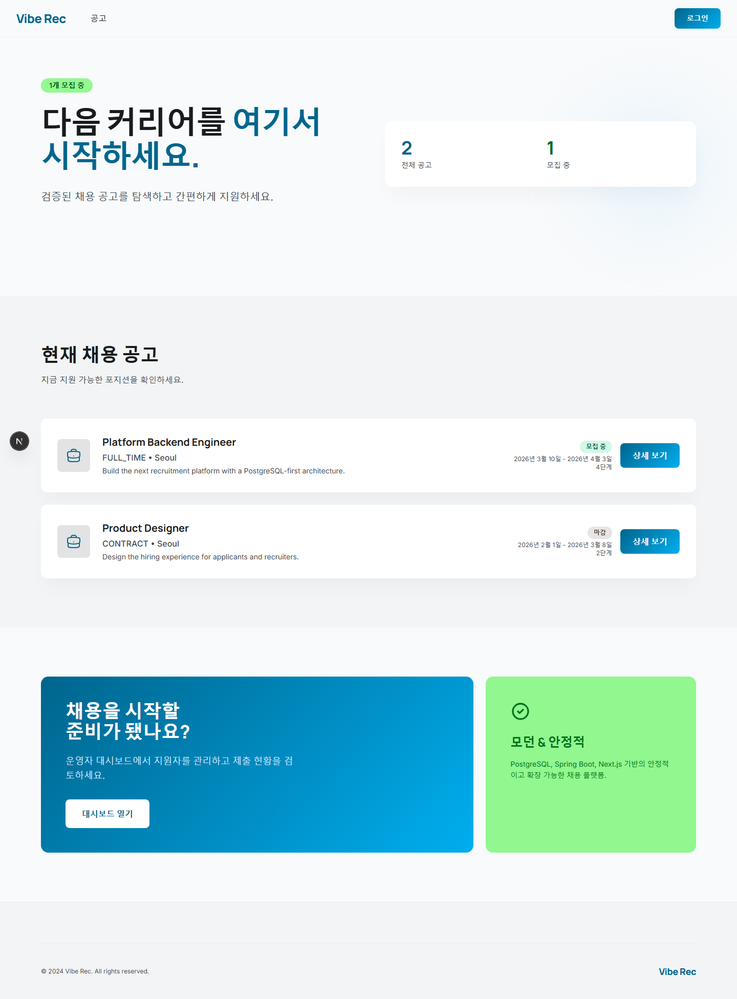
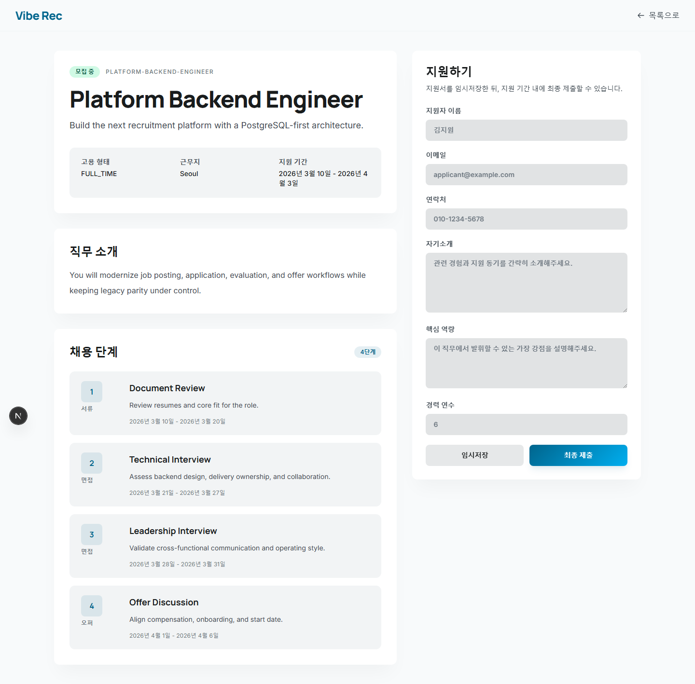
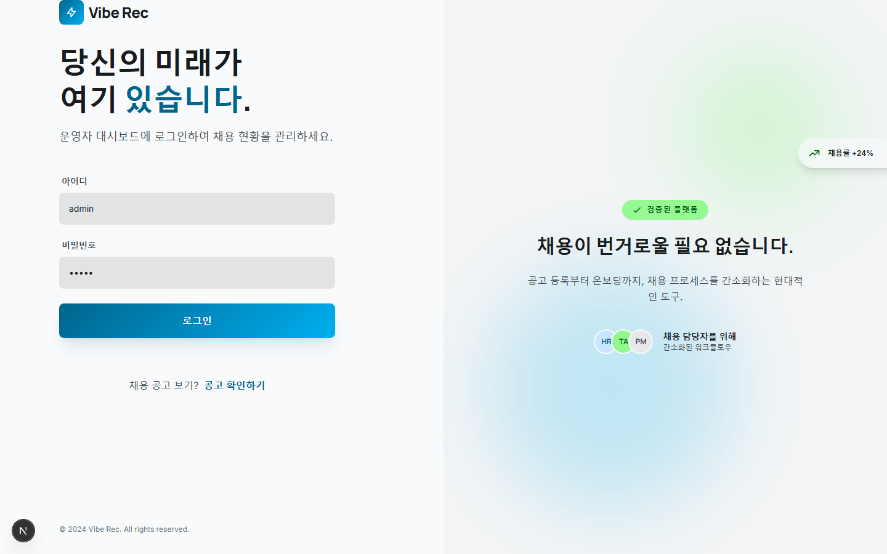
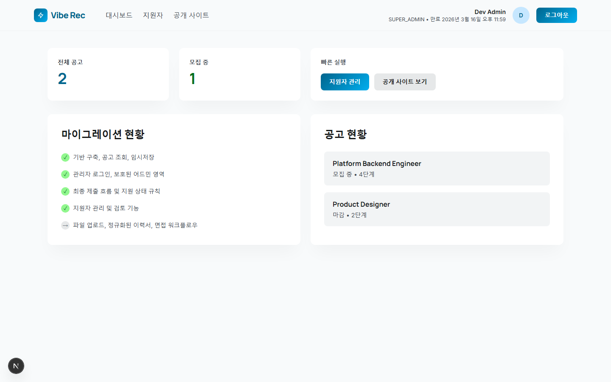
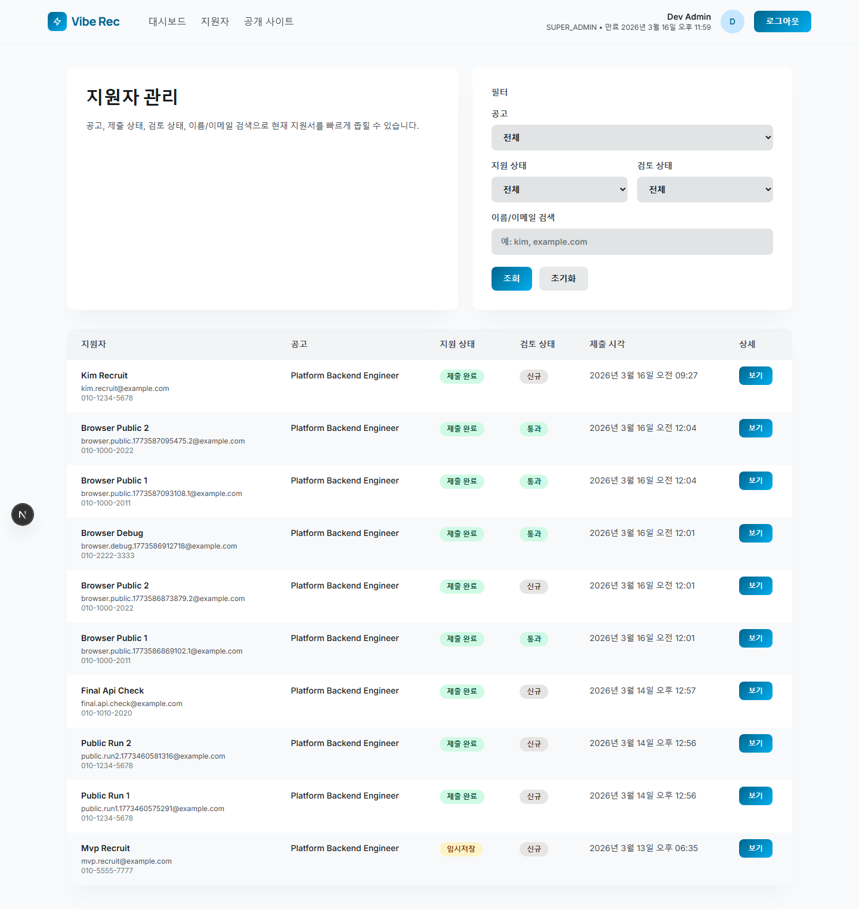

# vibe-rec

레거시 채용 시스템을 PostgreSQL 기준으로 다시 설계하면서, 화면과 업무를 단계적으로 옮기는 현대화 작업 저장소다.  
기존 시스템을 한 번에 갈아엎지 않고, `공고 조회 -> 지원서 저장/제출 -> 관리자 인증 -> 운영자 지원자 관리` 순서로 작게 끊어서 검증하면서 올리고 있다.

현재 저장소는 “초기 부트스트랩” 단계는 이미 지났고, **지원자 제출 MVP + 운영자 지원자 검토 MVP**까지 동작하는 상태다.

## 기술 스택

### Web

- Next.js 16 App Router
- React 19
- TypeScript
- shadcn/ui
- Tailwind CSS 4

### API

- Java 21
- Spring Boot 4
- Spring Web MVC
- Spring Validation
- Spring Data JPA
- Flyway

### Database

- PostgreSQL 16
- `jsonb` 기반 원본 지원서 payload 보존
- 단일 타깃 스키마 기반 설계

### Local Infra

- Docker Compose

## 현재 구현 범위

### 1. 지원자 화면

- `/`
  - 공고 목록 조회
  - 공고 상태, 지원 기간, step 수 표시
- `/job-postings/[id]`
  - 공고 상세 조회
  - 전형(step) 조회
  - 지원서 draft 저장
  - 지원서 최종 제출
  - 제출 후 수정 잠금

### 2. 관리자 인증 / 운영자 셸

- `/login`
  - 개발용 관리자 계정 로그인
- `/admin`
  - HTTP-only 쿠키 + DB 세션 기반 보호 셸
  - 비로그인 상태면 `/login`으로 리다이렉트
- `/admin/applicants`
  - 지원자 목록 조회
  - 공고 / 제출 상태 / 검토 상태 / 이름·이메일 검색
- `/admin/applicants/[id]`
  - 지원자 상세 조회
  - 원본 지원서 payload 조회
  - 검토 상태 변경

### 3. 현재 반영된 업무 규칙

- 지원서는 `DRAFT`, `SUBMITTED` 상태를 가진다.
- 최종 제출 후에는 더 이상 수정할 수 없다.
- 운영자 검토 상태는 `NEW -> IN_REVIEW -> PASSED/REJECTED` 순서만 허용한다.
- `SUBMITTED` 상태의 지원서만 운영 검토 대상으로 올릴 수 있다.
- 최종 검토 상태(`PASSED`, `REJECTED`)에서 다시 `IN_REVIEW`로 되돌릴 수 없다.

## 아직 안 된 것

다음 범위는 아직 남아 있다.

- 첨부파일 업로드
- 지원서 정규화 테이블 확장
- 운영자 권한 세분화
- 면접 배정 / 평가 / 합불 집계
- 최종 합격 / 통지 / 후속 제출(todo)
- Testcontainers / CI 파이프라인
- legacy 데이터 이관 및 컷오버 검증

## 디렉터리 구조

```text
vibe-rec/
  apps/
    api/        Spring Boot API
    web/        Next.js Web
  docs/         현대화 계획 / 분석 문서
  infra/
    docker/     로컬 PostgreSQL compose
    postgres/   PostgreSQL 관련 초기 구조
  legacy-notes/ 레거시 분석 메모
  output/       실행 로그 / Playwright 산출물
```

## 데이터베이스 구조

현재 MVP에서 핵심으로 쓰는 스키마는 아래와 같다.

### `recruit`

- `job_posting`
  - 공고 마스터
- `job_posting_step`
  - 공고별 전형 단계
- `application`
  - 지원서 헤더
  - 제출 상태, 검토 상태, 검토 메모, 주요 지원자 정보 저장
- `application_resume_raw`
  - 원본 지원서 payload 저장
  - `jsonb` 사용

### `platform`

- `admin_account`
  - 관리자 계정
- `admin_session`
  - 관리자 로그인 세션

## 주요 API

### 공통

- `GET /api/v1/ping`

### 공고

- `GET /api/v1/job-postings`
- `GET /api/v1/job-postings/{id}`

### 지원서

- `POST /api/v1/job-postings/{id}/application-draft`
- `POST /api/v1/job-postings/{id}/application-submit`

### 관리자 인증

- `POST /api/v1/admin/auth/login`
- `GET /api/v1/admin/auth/session`
- `POST /api/v1/admin/auth/logout`

### 운영자 지원자 관리

- `GET /api/v1/admin/applicants`
- `GET /api/v1/admin/applicants/{id}`
- `PATCH /api/v1/admin/applicants/{id}/review-status`

## 로컬 실행

### 1. PostgreSQL

```bash
cd infra/docker
docker compose up -d
```

기본 포트는 `5435`다.

- DB: `vibe_rec`
- USER: `vibe_rec`
- PASSWORD: `vibe_rec`

### 2. API

```bash
cd apps/api
.\mvnw.cmd spring-boot:run
```

기본 포트는 `8080`이다.  
이미 다른 프로세스가 쓰고 있으면 아래처럼 바꿔서 올리면 된다.

```powershell
$env:SERVER_PORT="8083"
.\mvnw.cmd spring-boot:run
```

### 3. Web

```bash
cd apps/web
npm install
npm run dev
```

기본적으로 Web은 `http://127.0.0.1:8080/api`를 바라본다.  
API 포트를 바꿨다면 `apps/web/.env.local`에 맞춰 주면 된다.

```env
API_BASE_URL=http://127.0.0.1:8083/api
NEXT_PUBLIC_API_BASE_URL=http://127.0.0.1:8083/api
```

## 개발용 관리자 계정

개발 검증을 위해 테스트용 관리자 계정을 자동으로 생성한다.

- 아이디: `admin`
- 비밀번호: `admin`

이 계정은 API 시작 시 `app.admin.dev-account.*` 설정값으로 upsert 된다.  
운영 환경까지 같은 방식으로 가져갈 생각은 없고, 이후 단계에서 `local` 전용 프로파일로 분리할 예정이다.

## 검증 명령

### Backend

```bash
cd apps/api
.\mvnw.cmd test
```

### Frontend lint

```bash
cd apps/web
npm run lint
```

### Frontend build

```bash
cd apps/web
npm run build
```

### 브라우저 검증

Playwright Chromium으로 아래 흐름을 실제로 확인한다.

- public: 공고 진입 -> draft 저장 -> 최종 제출 -> 제출 잠금
- admin auth: `/admin` 접근 -> `/login` 리다이렉트 -> 로그인 -> 로그아웃
- applicant review: 지원자 검색 -> 상세 진입 -> `NEW -> IN_REVIEW -> PASSED` -> 역전이 차단

실행 산출물은 `output/playwright/` 아래에 남긴다.

## 사용자 흐름

### 지원자

1. 홈 화면에서 현재 모집 중인 공고 목록을 확인합니다.
2. 관심 있는 공고를 선택해 상세 정보와 전형 단계를 살펴봅니다.
3. 지원서를 작성하고 임시저장 버튼으로 draft를 저장합니다.
4. 준비가 되면 최종 제출 버튼을 눌러 지원을 완료합니다.
5. 제출 이후에는 지원서 수정이 잠기고 제출 완료 상태로 전환됩니다.

### 운영자

1. `/login`에서 관리자 계정으로 로그인합니다.
2. 대시보드에서 전체 공고 수, 모집 중 공고 수, 마이그레이션 진행 현황을 확인합니다.
3. 지원자 관리 페이지에서 공고별·상태별 필터와 이름/이메일 검색으로 지원자를 조회합니다.
4. 지원자 상세 페이지에서 원본 지원서 payload를 확인하고 검토 상태를 변경합니다.
5. 검토 상태는 `NEW -> IN_REVIEW -> PASSED/REJECTED` 순서로만 진행되며, 최종 상태에서 되돌릴 수 없습니다.

## 화면 예시

### 공고 목록

지원자가 처음 진입하는 화면으로, 현재 등록된 채용 공고를 카드 형태로 보여줍니다. 각 공고에 고용 형태, 근무지, 지원 기간, 전형 단계 수가 표시되어 있어서 지원 전에 전체 채용 현황을 빠르게 훑어볼 수 있습니다.



### 공고 상세 / 지원서 작성

공고를 선택하면 왼쪽에 직무 소개와 전형 단계(서류 → 면접 → 오퍼)가 타임라인으로 정리되고, 오른쪽에 지원서 입력 폼이 배치됩니다. 지원자 이름, 이메일, 연락처, 자기소개, 핵심 역량, 경력 연수를 입력한 뒤 임시저장 또는 최종 제출을 선택할 수 있습니다. 최종 제출 후에는 폼이 잠겨 더 이상 수정할 수 없습니다.



### 관리자 로그인

운영자 전용 인증 화면입니다. 아이디와 비밀번호를 입력해 로그인하면 HTTP-only 쿠키 기반 세션이 생성되고, 이후 `/admin` 하위 페이지에 접근할 수 있습니다. 비로그인 상태에서 관리자 페이지에 접근하면 이 화면으로 리다이렉트됩니다.



### 운영자 대시보드

로그인 직후 진입하는 관리자 메인 화면입니다. 상단에 전체 공고 수와 모집 중 공고 수를 숫자로 보여주고, 왼쪽 마이그레이션 현황 카드에서 현재까지 완료된 현대화 단계와 남은 작업을 한눈에 파악할 수 있습니다. 오른쪽 공고 현황 카드에서는 각 공고의 모집 상태와 전형 단계 수를 확인할 수 있습니다.



### 지원자 목록

운영자가 전체 지원자를 관리하는 화면입니다. 상단 필터 영역에서 공고, 제출 상태(`DRAFT`/`SUBMITTED`), 검토 상태(`NEW`/`IN_REVIEW`/`PASSED`/`REJECTED`)를 조합하고 이름이나 이메일로 검색할 수 있습니다. 테이블에는 지원자 이름, 지원 공고, 제출 상태, 검토 상태, 제출 일시가 표시되어 한 화면에서 지원 현황을 빠르게 파악할 수 있습니다.



## 현재 상태 판단

현대화 전체 로드맵으로 보면 아직 초반이다.  
다만 MVP 관점에서는 아래 범위가 실제로 동작한다.

- 공고 조회
- 지원서 draft / submit
- 제출 잠금
- 관리자 로그인 / 세션
- 운영자 지원자 목록 / 상세 / 검토 상태 변경

즉, 지금 단계는 “기술 검증용 스파이크”를 넘어 **실제 업무 플로우 일부가 연결된 MVP** 상태로 보는 게 맞다.

## 다음 우선순위

다음 작업은 아래 순서로 가는 편이 맞다.

1. 첨부파일 업로드
2. 지원서 정규화 확장
3. 운영자 권한 분리
4. 면접 / 평가
5. 최종 결과 / 통지
6. 이관 / 컷오버 검증

## 메모

- 테스트에서는 `spring.jpa.open-in-view` 경고가 계속 보여서 별도 확인이 필요하다.
- 현재 운영자 검토 에러 메시지는 API에서 구체 문구가 내려오도록 보정했다.
- 브라우저 산출물과 런타임 로그는 `output/` 아래에만 남기고 Git에는 올리지 않는다.
