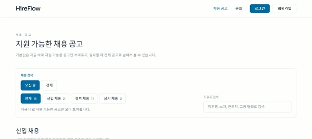
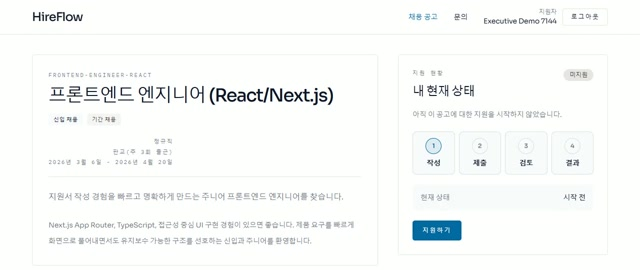
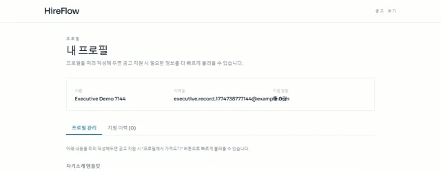
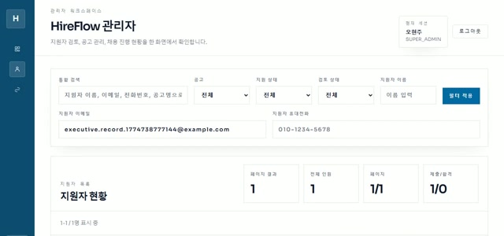

# vibe-rec

vibe-rec는 공고 탐색, 프로필 작성, 지원서 제출, 관리자 검토를 한 흐름으로 연결한 채용 운영 제품입니다.

## 주요 화면

### 채용 공고 보드



지원 가능한 공고를 기본값으로 보여주고, 신입/경력/상시 채용과 키워드 검색으로 바로 좁힐 수 있습니다.

### 공고 상세와 지원 상태



공고 설명, 채용 단계, 현재 지원 상태를 한 화면에서 확인하면서 바로 지원을 시작할 수 있습니다.

### 프로필 선작성



지원 전에 프로필을 먼저 저장해 두고, 이후 공고별 질문 작성에 반복 활용하는 구조입니다.

### 관리자 지원자 운영



관리자는 지원자 검색, 공고 필터, 상태 확인을 한 화면에서 처리할 수 있습니다.

## 스택

- Web: Next.js, React, TypeScript, Tailwind CSS
- API: Spring Boot, Spring Data JPA, Flyway
- DB: PostgreSQL

## 로컬 실행

### PostgreSQL

```powershell
docker compose -f compose.deploy.yaml up -d postgres
```

### API

```powershell
cd apps/api
.\gradlew.bat bootRun --args=--server.port=8080
```

### Web

```powershell
cd apps/web
$env:API_BASE_URL="http://127.0.0.1:8080/api"
$env:NEXT_PUBLIC_API_BASE_URL="http://127.0.0.1:8080/api"
npm run dev
```

## 데모 데이터

- Flyway migration: `apps/api/src/main/resources/db/migration/V25__refresh_realistic_demo_dataset.sql`
- 수동 seed: `apps/api/src/main/resources/db/seed/demo-seed.sql`

```powershell
docker exec -i vibe-rec-postgres psql -v ON_ERROR_STOP=1 -U vibe_rec -d vibe_rec < apps/api/src/main/resources/db/seed/demo-seed.sql
```

핫스팟 공고:

- `1001 / platform-backend-engineer / 백엔드 플랫폼 엔지니어`
- 데모 지원자 `5,000명`

## 검증

```powershell
cd apps/api
.\gradlew.bat test --console=plain
```
